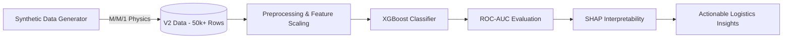

# Maritime Congestion Predictive Modeling 🚢

**An end-to-end Machine Learning pipeline to predict port congestion and vessel delays using Synthetic Data and Explainable AI (SHAP).**

This repository demonstrates a complete predictive system designed to forecast shipping delays based on port capacity, environmental conditions (wind/weather), and tactical arrival data. 

---

## 🌟 Key Highlights

- **Domain-Driven Synthetic Data Generation**: Designed a custom Python generator that models real-world maritime physics (Exponential Yard Capacity Saturation based on M/M/1 Queueing Theory) to simulate realistic port bottlenecks without violating data privacy.
- **Model Evolution & Benchmarking**: Systematically evolved from simple Linear Baseline data (V1) to complex Non-Linear operational realities (V2), benchmarking **Logistic Regression**, **Random Forest**, and **XGBoost**.
- **99%+ Prediction Accuracy**: Achieved state-of-the-art ROC-AUC by leveraging Gradient Boosting (XGBoost) to capture conditionally compounding interactions (e.g., "Midnight Gridlock" penalties).
- **Explainable AI (XAI)**: Integrated **SHAP** (Shapley Additive Explanations) for both Strategic (Global) and Tactical (Local) interpretability, ensuring every prediction is actionable for port operators.
- **Professional Reporting**: includes a comprehensive technical analysis report authored in **LaTeX**, documenting all design decisions and operational assumptions.

---

## 📊 System Architecture & Methodology



---

## 📂 Project Structure

- **`data/`**: Custom generator script (`generate_synthetic_data.py`) and sample datasets.
- **`notebooks/`**: Fully annotated Jupyter notebook (`01_comprehensive_analysis.ipynb`) containing EDA, Model Benchmarking, and SHAP visualizations.
- **`docs/`**: Professional summary reports in **LaTeX** and **PDF** formats.
- **`requirements.txt`**: Core dependencies (XGBoost, SHAP, Scikit-learn, etc.).

---

## 🚀 Quick Start

**1. Clone the repository**
```bash
git clone https://github.com/your-username/Maritime-Congestion-Predictive-Modeling.git
cd Maritime-Congestion-Predictive-Modeling
```

**2. Install dependencies**
```bash
pip install -r requirements.txt
```

**3. Explore the Analysis**
Open `notebooks/01_comprehensive_analysis.ipynb` to see the full data science lifecycle, from visualization to explainability.

---

## 📝 Analysis Snippets

> "The data complexity drives the model selection, not the other way around. Our evolution from V1 to V2 showed that simpler models fail to capture the exponential compounding effects of port saturation—a gap XGBoost bridge effortlessly."

---

## 🏆 Certifications & Reports
For the full mathematical background and domain references (including research on Cat Lai Port bottlenecks and PEMA crane safety standards), please refer to:
👉 [**Technical Analysis Report (PDF)**](docs/technical_report.pdf)

---

> Built by **Nguyen Duc Tuan Dat** | Applied AI & Data Engineer
